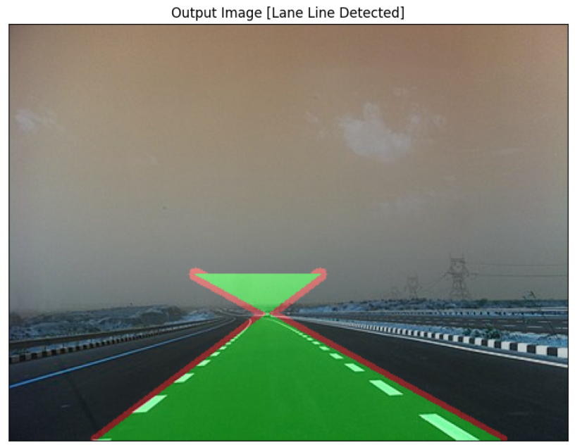
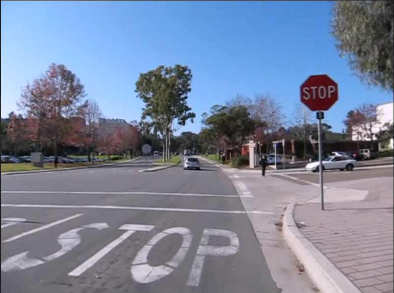

# Detection of Road Lanes and Traffic Signs

This project focuses on the detection of road lanes and traffic signs using computer vision and deep learning techniques. It was developed during my internship at **Soften Technologies**.

---

## 📌 Overview

The goal of this project is to assist autonomous driving systems by:
- Detecting **road lane boundaries** using OpenCV.
- Recognizing and classifying **traffic signs** using deep learning (CNN-based models).

This notebook demonstrates both visual detection and classification in real-time or pre-recorded road scenes.

---

## 🧠 Technologies Used

- **Python**
- **OpenCV**
- **TensorFlow / Keras** (for deep learning models)
- **NumPy**
- **Jupyter Notebook**

---

## 🚀 How to Run the Project

1. Clone the repo or download the `.ipynb` notebook
2. Install the required Python libraries:
   ```bash
   pip install opencv-python numpy tensorflow

   ## 📷 Demo

Detection of lanes is showcased on an input image, and the results are shown on the output image below.

### ▶️ Input Image:


### ✅ Output Image:


Detection of lanes is showcased on an input image, and the results are shown on the output image below.

### ✅ Output Image detecting Traffic Signs:


## The project includes a **Gradio Interface**, allowing users to upload images and instantly view lane and traffic sign detection results.
## Author:
Namita S
